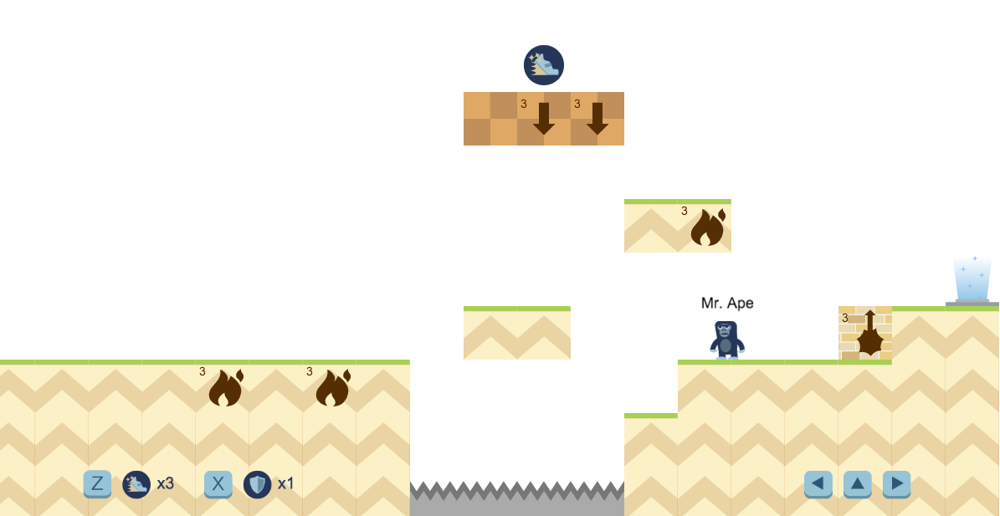

# Ape Escape

## About

## Setup

1. Install dependencies `npm install`
2. Install gulp `npm install -g gulp`
3. Install bower `npm install -g bower`
5. Run `bower install`
4. Run `gulp build`

## Development

1. Run `gulp watch`

## Run

1. `cd server`
2. Run `node server.js`
